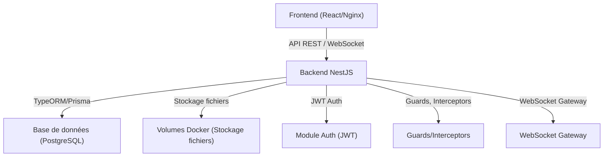

# Migration du Backend vers NestJS

## Objectif
Migrer le backend actuel (Express.js) vers NestJS pour bénéficier d’une architecture modulaire, d’une meilleure maintenabilité, et d’une sécurité renforcée.

---

## 1. Analyse et Audit
- Cartographier toutes les routes, middlewares, services, modèles et accès à la base de données existants.
- Identifier les dépendances critiques (auth, stockage, WebSocket, etc.).
- Lister les fonctionnalités à migrer.

## 2. Initialisation du Projet NestJS
- Créer un nouveau repository ou un dossier `backend-nestjs`.
- Initialiser un projet NestJS (`nest new backend-nestjs`).
- Configurer TypeScript, ESLint, Prettier.
- Mettre en place la configuration des variables d’environnement.

## 3. Migration Modulaire
- **Controllers** : Migrer chaque route Express en Controller NestJS.
- **Services** : Déplacer la logique métier dans des Services NestJS.
- **Entities/DTOs** : Définir les modèles de données (TypeORM/Prisma Entities, DTOs pour validation).
- **Guards/Middlewares** : Adapter les middlewares (auth, feature flags, etc.) en Guards/Interceptors NestJS.
- **WebSocket** : Migrer la logique temps réel dans des Gateways NestJS.
- **Intégrations externes** : Adapter les intégrations (Supabase, Mapbox, etc.) en Providers.

## 4. Migration de la Base de Données
- Reprendre le schéma PostgreSQL existant.
- Générer les entités correspondantes.
- Mettre en place les migrations (TypeORM/Prisma).

## 5. Tests et Validation
- Écrire des tests unitaires et d’intégration pour chaque module migré.
- Tester la compatibilité API avec le frontend.
- Mettre en place un environnement de staging.

## 6. Documentation
- Documenter chaque module migré.
- Mettre à jour les guides de contribution et de déploiement.

## 7. Déploiement Progressif
- Déployer en parallèle (blue/green ou canary release si possible).
- Monitorer les performances et les erreurs.
- Basculer la production une fois validé.

---

## Schéma d’architecture cible

---

## Suivi & Collaboration
- Ce fichier doit être mis à jour à chaque étape de la migration.
- Toute l’équipe est invitée à proposer des améliorations ou à signaler des points de blocage. 